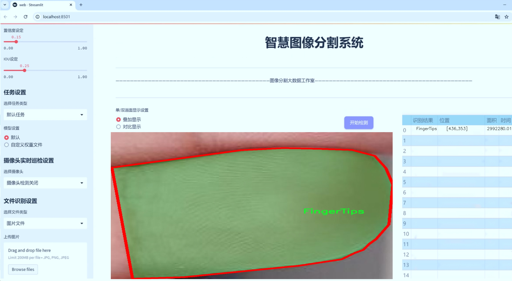
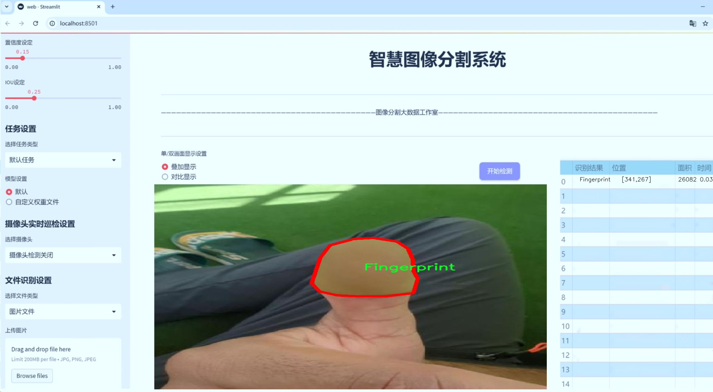
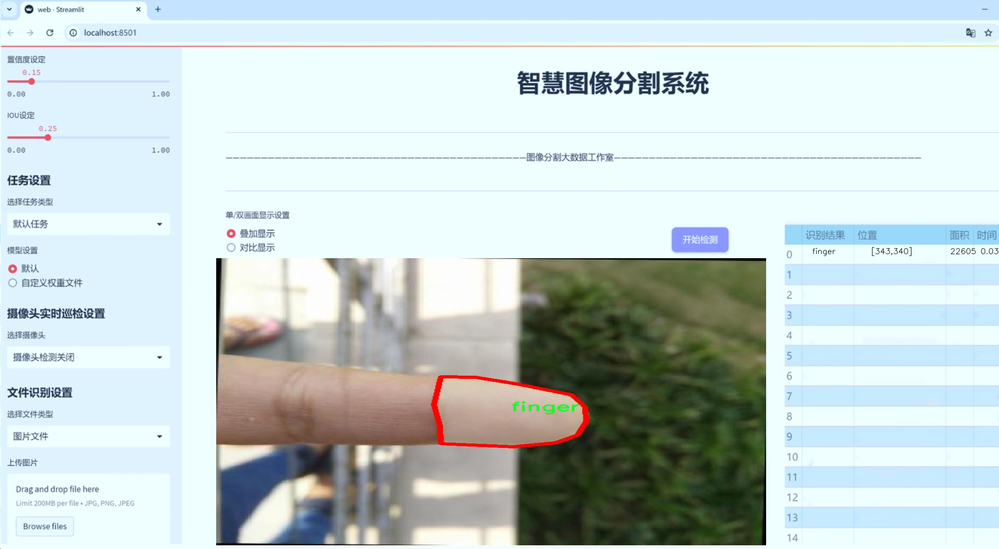
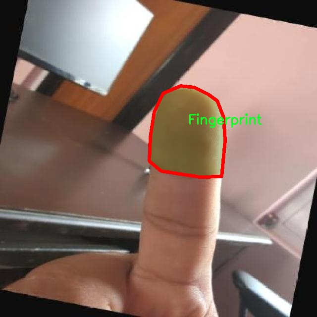
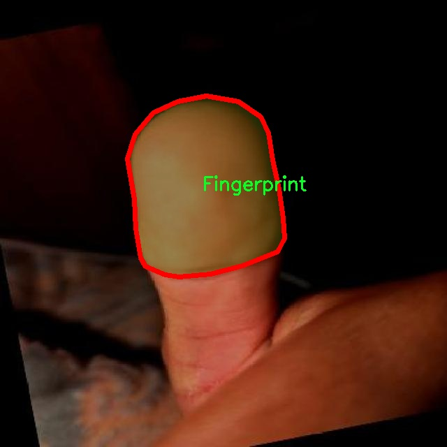
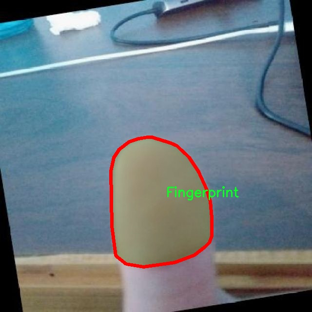
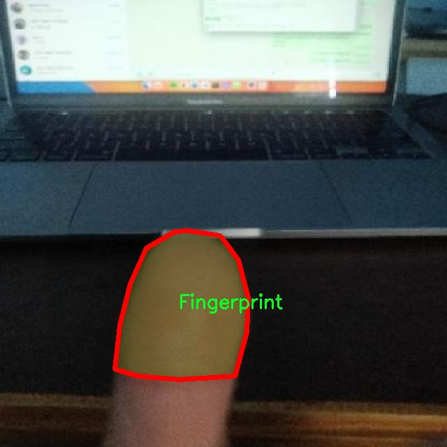
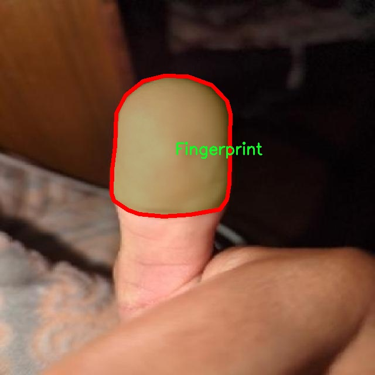

# 指尖图像分割系统源码＆数据集分享
 [yolov8-seg-C2f-Faster-EMA＆yolov8-seg-C2f-DWR等50+全套改进创新点发刊_一键训练教程_Web前端展示]

### 1.研究背景与意义

项目参考[ILSVRC ImageNet Large Scale Visual Recognition Challenge](https://gitee.com/YOLOv8_YOLOv11_Segmentation_Studio/projects)

项目来源[AAAI Global Al lnnovation Contest](https://kdocs.cn/l/cszuIiCKVNis)

研究背景与意义

随着计算机视觉技术的迅猛发展，图像分割作为其中一项重要的研究方向，已广泛应用于医学影像分析、自动驾驶、智能监控等多个领域。尤其是在生物特征识别和人机交互中，指尖图像的精确分割显得尤为重要。指尖图像不仅包含丰富的纹理信息，还承载着个体身份的独特性，因此，针对指尖图像的高效分割技术的研究具有重要的理论价值和实际应用意义。

近年来，YOLO（You Only Look Once）系列模型因其高效的实时检测能力而受到广泛关注。YOLOv8作为该系列的最新版本，在准确性和速度上均有显著提升，适用于各种复杂场景的目标检测与分割任务。然而，传统YOLOv8模型在处理细粒度图像分割时，尤其是指尖图像的分割效果仍有待改进。这主要是由于指尖图像的复杂背景、指尖与背景的颜色相似性以及指尖的多样性等因素，使得模型在分割时容易出现误判和漏判。因此，基于改进YOLOv8的指尖图像分割系统的研究具有重要的学术意义和应用前景。

本研究所使用的数据集包含1600幅指尖图像，涵盖了四个类别：FingerTips、FingerTips-2DFX、Fingerprint和finger。这些类别的多样性为模型的训练提供了丰富的样本，有助于提高模型的泛化能力。通过对这些图像进行精细的标注与分类，可以为改进YOLOv8模型提供良好的基础数据，进而提升指尖图像的分割精度。此外，数据集中不同类别的指尖图像在形态、纹理和颜色等方面的差异，能够有效地促进模型对指尖特征的学习和提取。

本研究的意义不仅在于提升指尖图像分割的准确性，更在于推动指尖图像处理技术的发展。通过改进YOLOv8模型，能够实现对指尖图像的快速、准确分割，为后续的指纹识别、身份验证等应用提供支持。此外，该研究还将为其他细粒度图像分割任务提供借鉴，推动计算机视觉领域的进一步发展。

综上所述，基于改进YOLOv8的指尖图像分割系统的研究，旨在解决当前指尖图像分割中存在的技术瓶颈，提升分割效果，为生物特征识别和人机交互等领域的应用提供更为精准的技术支持。这一研究不仅具有重要的理论价值，还将在实际应用中发挥重要作用，推动相关技术的进步与发展。

### 2.图片演示







##### 注意：由于此博客编辑较早，上面“2.图片演示”和“3.视频演示”展示的系统图片或者视频可能为老版本，新版本在老版本的基础上升级如下：（实际效果以升级的新版本为准）

  （1）适配了YOLOV8的“目标检测”模型和“实例分割”模型，通过加载相应的权重（.pt）文件即可自适应加载模型。

  （2）支持“图片识别”、“视频识别”、“摄像头实时识别”三种识别模式。

  （3）支持“图片识别”、“视频识别”、“摄像头实时识别”三种识别结果保存导出，解决手动导出（容易卡顿出现爆内存）存在的问题，识别完自动保存结果并导出到tempDir中。

  （4）支持Web前端系统中的标题、背景图等自定义修改，后面提供修改教程。

  另外本项目提供训练的数据集和训练教程,暂不提供权重文件（best.pt）,需要您按照教程进行训练后实现图片演示和Web前端界面演示的效果。

### 3.视频演示

[3.1 视频演示](https://www.bilibili.com/video/BV1jSyRYPE8U/)

### 4.数据集信息展示

##### 4.1 本项目数据集详细数据（类别数＆类别名）

nc: 4
names: ['FingerTips', 'FingerTips-2DFX', 'Fingerprint', 'finger']


##### 4.2 本项目数据集信息介绍

数据集信息展示

在本研究中，我们采用了名为“fingertip segmentation”的数据集，以训练和改进YOLOv8-seg的指尖图像分割系统。该数据集专注于指尖区域的精准识别与分割，旨在提升计算机视觉领域在手部图像处理中的表现。数据集包含四个主要类别，分别为“FingerTips”、“FingerTips-2DFX”、“Fingerprint”和“finger”。这些类别的设置不仅涵盖了指尖的基本形态，还考虑到了不同的视觉特征和应用场景，确保了模型在多样化环境下的鲁棒性和准确性。

首先，“FingerTips”类别专注于指尖的整体形状和特征。这一类别的图像数据来源于多种手部姿势和角度，确保了数据的多样性和丰富性。通过对这一类别的训练，模型能够有效地识别出指尖的轮廓和细节，为后续的分割任务奠定基础。

其次，“FingerTips-2DFX”类别则引入了二维特效的指尖图像。这一类别的设计旨在模拟指尖在不同光照和背景条件下的表现，增加了数据集的复杂性和挑战性。通过训练模型识别这一类别，能够提高其在实际应用中对指尖图像的适应能力，尤其是在光照变化或背景干扰较大的情况下。

“Fingerprint”类别则专注于指纹的细节特征。指纹作为个体身份识别的重要依据，其图像的准确分割对于生物识别技术的应用至关重要。通过将指纹图像纳入数据集，模型不仅能够学习到指纹的独特纹理特征，还能在分割过程中更好地处理指尖与指纹之间的关系，从而提高整体分割的精度。

最后，“finger”类别则涵盖了指尖以外的手指部分。这一类别的引入使得模型在处理指尖图像时，能够更好地理解手指的整体结构和相对位置，从而在分割时避免出现误判和漏判的情况。通过综合考虑指尖及其周围环境，模型的分割效果将更加自然和准确。

整个“fingertip segmentation”数据集的构建不仅考虑了图像的多样性和复杂性，还注重了各类别之间的相互关系与特征互补。数据集中的图像均经过精心标注，确保了每个类别的准确性和一致性，为YOLOv8-seg模型的训练提供了坚实的基础。在实际应用中，该数据集的多样性和丰富性将极大地提升指尖图像分割系统的性能，使其在手部识别、虚拟现实、增强现实等领域展现出更强的应用潜力。

通过对“fingertip segmentation”数据集的深入分析与应用，我们期望能够推动指尖图像分割技术的发展，助力相关领域的研究与实践，最终实现更高效、更智能的图像处理解决方案。











### 5.全套项目环境部署视频教程（零基础手把手教学）

[5.1 环境部署教程链接（零基础手把手教学）](https://www.bilibili.com/video/BV1jG4Ve4E9t/?vd_source=bc9aec86d164b67a7004b996143742dc)


[5.2 安装Python虚拟环境创建和依赖库安装视频教程链接（零基础手把手教学）](https://www.bilibili.com/video/BV1nA4VeYEze/?vd_source=bc9aec86d164b67a7004b996143742dc)

### 6.手把手YOLOV8-seg训练视频教程（零基础小白有手就能学会）

[6.1 手把手YOLOV8-seg训练视频教程（零基础小白有手就能学会）](https://www.bilibili.com/video/BV1cA4VeYETe/?vd_source=bc9aec86d164b67a7004b996143742dc)


按照上面的训练视频教程链接加载项目提供的数据集，运行train.py即可开始训练



     Epoch   gpu_mem       box       obj       cls    labels  img_size
     1/200     0G   0.01576   0.01955  0.007536        22      1280: 100%|██████████| 849/849 [14:42<00:00,  1.04s/it]
               Class     Images     Labels          P          R     mAP@.5 mAP@.5:.95: 100%|██████████| 213/213 [01:14<00:00,  2.87it/s]
                 all       3395      17314      0.994      0.957      0.0957      0.0843

     Epoch   gpu_mem       box       obj       cls    labels  img_size
     2/200     0G   0.01578   0.01923  0.007006        22      1280: 100%|██████████| 849/849 [14:44<00:00,  1.04s/it]
               Class     Images     Labels          P          R     mAP@.5 mAP@.5:.95: 100%|██████████| 213/213 [01:12<00:00,  2.95it/s]
                 all       3395      17314      0.996      0.956      0.0957      0.0845

     Epoch   gpu_mem       box       obj       cls    labels  img_size
     3/200     0G   0.01561    0.0191  0.006895        27      1280: 100%|██████████| 849/849 [10:56<00:00,  1.29it/s]
               Class     Images     Labels          P          R     mAP@.5 mAP@.5:.95: 100%|███████   | 187/213 [00:52<00:00,  4.04it/s]
                 all       3395      17314      0.996      0.957      0.0957      0.0845


### 7.50+种全套YOLOV8-seg创新点代码加载调参视频教程（一键加载写好的改进模型的配置文件）

[7.1 50+种全套YOLOV8-seg创新点代码加载调参视频教程（一键加载写好的改进模型的配置文件）](https://www.bilibili.com/video/BV1Hw4VePEXv/?vd_source=bc9aec86d164b67a7004b996143742dc)

### 8.YOLOV8-seg图像分割算法原理

原始YOLOV8-seg算法原理

YOLOv8-seg作为YOLO系列中的最新版本，继承并发展了前几代模型的优点，特别是在目标检测和分割任务中的应用。该算法的核心在于其独特的网络结构和高效的特征提取机制，使其在速度和精度上都表现出色。YOLOv8-seg的设计理念是将目标检测与实例分割相结合，通过深度学习技术实现对图像中目标的精准定位和细致分割。

YOLOv8-seg的网络结构主要由三个部分组成：Backbone、Neck和Head。Backbone负责特征提取，它采用了CSPDarknet结构，通过多个残差块的堆叠来增强特征的表达能力。每个残差块都经过精心设计，以确保信息的有效传递和梯度的流动。相较于前代模型，YOLOv8-seg引入了C2f模块，这一模块通过将输入特征图分为两个分支，分别进行降维处理，进而实现更高维度特征的融合。这种设计不仅提高了特征提取的效率，还增强了模型的梯度流，从而改善了检测和分割的效果。

在特征提取完成后，Neck部分通过特征金字塔网络（FPN）和路径聚合网络（PAN）对不同尺度的特征进行融合。FPN结构使得网络能够有效地处理多尺度特征，保证了小目标和大目标的检测能力。而PAN则进一步增强了特征的传递和融合，确保了上下文信息的完整性。通过这种特征融合机制，YOLOv8-seg能够更好地捕捉图像中的细节信息，为后续的目标检测和分割提供了坚实的基础。

Head部分是YOLOv8-seg的核心，采用了解耦的检测头结构。与传统的检测方法不同，YOLOv8-seg通过两个并行的卷积分支分别计算目标的回归和分类损失。这种解耦设计使得模型在处理复杂场景时能够更灵活地调整，显著提高了检测的准确性和效率。此外，YOLOv8-seg还引入了无锚框（Anchor-Free）的检测方式，直接预测目标的中心点和宽高比例，这一创新不仅减少了对Anchor框的依赖，还提高了模型的推理速度。

在实例分割方面，YOLOv8-seg通过对目标的边界进行精细化处理，实现了高质量的分割效果。模型通过对特征图的进一步处理，提取出目标的轮廓信息，从而实现对每个实例的精确分割。这一过程不仅依赖于Backbone和Neck的特征提取与融合能力，还需要Head部分对分割任务的专门设计，使得分割结果更加准确和细致。

YOLOv8-seg的优势不仅体现在其高效的结构设计上，还包括其广泛的硬件支持和易于训练的特性。该模型能够在多种硬件平台上高效运行，适应不同的应用场景。同时，YOLOv8-seg原生支持自定义数据集，用户可以根据具体需求进行模型的训练和调整。这种灵活性使得YOLOv8-seg在实际应用中具备了极大的适应性，能够满足不同领域的需求。

在实际应用中，YOLOv8-seg被广泛应用于自动驾驶、安防监控、医疗影像分析等多个领域。其高效的目标检测和分割能力，使得它在复杂场景下仍能保持优异的性能，成为行业内的重要工具。随着YOLOv8-seg的不断发展和优化，未来其在更多应用场景中的潜力将得到进一步挖掘。

总的来说，YOLOv8-seg通过其独特的网络结构、先进的特征提取与融合机制，以及灵活的检测和分割能力，成为了当前目标检测与实例分割领域中的一项重要技术。它不仅提高了目标检测的速度和准确性，还为实例分割任务提供了强有力的支持，展现了深度学习在计算机视觉领域的巨大潜力。随着技术的不断进步，YOLOv8-seg无疑将在未来的研究和应用中发挥更加重要的作用。


### 9.系统功能展示（检测对象为举例，实际内容以本项目数据集为准）

图9.1.系统支持检测结果表格显示

  图9.2.系统支持置信度和IOU阈值手动调节

  图9.3.系统支持自定义加载权重文件best.pt(需要你通过步骤5中训练获得)

  图9.4.系统支持摄像头实时识别

  图9.5.系统支持图片识别

  图9.6.系统支持视频识别

  图9.7.系统支持识别结果文件自动保存

  图9.8.系统支持Excel导出检测结果数据


### 10.50+种全套YOLOV8-seg创新点原理讲解（非科班也可以轻松写刊发刊，V11版本正在科研待更新）

#### 10.1 由于篇幅限制，每个创新点的具体原理讲解就不一一展开，具体见下列网址中的创新点对应子项目的技术原理博客网址【Blog】：


[10.1 50+种全套YOLOV8-seg创新点原理讲解链接](https://gitee.com/qunmasj/good)

#### 10.2 部分改进模块原理讲解(完整的改进原理见上图和技术博客链接)【如果此小节的图加载失败可以通过CSDN或者Github搜索该博客的标题访问原始博客，原始博客图片显示正常】
### YOLOv8模型原理

YOLOv8是YOLO系列最新的模型,具有非常优秀的检测精度和速度。根据网络的深度与特征图的宽度大小, YOLOv8算法分为:YOLOv8-n、YOLOv8一s 、YOLOv8-m 、 YOLOv8-l、和 YOLOv8-x 5个版本。按照网络结构图,YOLOv8可分为: Inpul 、 Backbone , Neck和Head 4部分。


Backbone采用了CSPDarknet 架构，由CBS (标准卷积层)、C2f模块和 SPPF(金字塔池化）组成。通过5次标准卷积层和C2f模块逐步提取图像特征，并在网络末尾添加SPPF模块，将任意大小的输入图像转换成固定大小的特征向量。分别取P3、P4、P5层的特征提取结果，向Head输出80×80、40 × 40、20×20三个尺度的特征层。
C2f模块借鉴了残差网络(ResNet)以及ELAN的思想，其结构分为两个分支，主干部分利用Bottleneckm2%模块逐步加深网络，分支部分保留输入层通道并与主干部分特征进行融合，如图所示。通过标准卷积层提取新的特征层，相比于YOLOv5使用的C3模块，C2f模块可以在卷积层和全连接层之间建立一个平滑的转换，从而实现了参数的共享，提高了模型的效率和泛化能力。
Head采用了PAN-FPN 结构,将 Backbone输入的3个特征层进行多尺度融合，进行自顶向下(FAN)和自底向上 (PAN)的特征传递，对金字塔进行增强，使不同尺寸的特征图都包含强目标语义信息和强目标特征信息，保证了对不同尺寸样本的准确预测。
Detect借鉴了Decoupled-Head 思想，用一个解耦检测头将输入的不同尺寸特征层分成2个分支进行检测。第1个分支在进行3次卷积后使进行回归任务，输出预测框。第2个分支在进行3次卷积后进行分类任务，输出类别的概率。采用Varifocal_Loss2”作为损失函数，其式为:


### Context_Grided_Network(CGNet)简介
参考该博客提出的一种轻量化语义分割模型Context Grided Network(CGNet)，以满足设备的运行需要。

CGNet主要由CG块构建而成，CG块可以学习局部特征和周围环境上下文的联合特征，最后通过引入全局上下文特征进一步改善联合特征的学习。


 
下图给出了在Cityscapes数据集上对现有的一些语义分割模型的测试效果，横轴表示参数量，纵轴表示准确率(mIoU)。可以看出，在参数量较少的情况下，CGNet可以达到一个比较好的准确率。虽与高精度模型相去甚远，但在一些对精度要求不高、对实时性要求比较苛刻的情况下，很有价值。


高精度模型，如DeepLab、DFN、DenseASPP等，动不动就是几十M的参数，很难应用在移动设备上。而上图中红色的模型，相对内存占用较小，但它们的分割精度却不是很高。作者认为主要原因是，这些小网络大多遵循着分类网络的设计思路，并没有考虑语义分割任务更深层次的特点。

空间依赖性和上下文信息对提高分割精度有很大的作用。作者从该角度出发，提出了CG block，并进一步搭建了轻量级语义分割网络CGNet。CG块具有以下特点： 

学习局部特征和上下文特征的联合特征；
通过全局上下文特征改进上述联合特征；
可以贯穿应用在整个网络中，从low level（空间级别）到high level（语义级别）。不像PSPNet、DFN、DenseASPP等，只在编码阶段以后捕捉上下文特征。；
只有3个下采样，相比一般5个下采样的网络，能够更好地保留边缘信息。
CGNet遵循“深而薄”的原则设计，整个网络又51层构成。其中，为了降低计算，大量使用了channel-wise conv.

小型语义分割模型：

需要平衡准确率和系统开销
进化路线：ENet -> ICNet -> ESPNet
这些模型基本都基于分类网络设计，在分割准确率上效果并不是很好
上下文信息模型：

大多数现有模型只考虑解码阶段的上下文信息并且没有利用周围的上下文信息
注意力机制：

CG block使用全局上下文信息计算权重向量，并使用其细化局部特征和周围上下文特征的联合特征

#### Context Guided Block
CG block由4部分组成：


此外，CG block还采用了残差学习。文中提出了局部残差学习（LRL）和全局残差学习（GRL）两种方式。 LRL添加了从输入到联合特征提取器的连接，GRL添加了从输入到全局特征提取器的连接。从直观上来说，GRL比LRL更能促进网络中的信息传递（更像ResNet~~），后面实验部分也进行了测试，的确GRL更能提升分割精度。


CGNet的通用网络结构如下图所示，分为3个stage，第一个stage使用3个卷积层抽取特征，第二和第三个stage堆叠一定数量的CG block，具体个数可以根据情况调整。最后，通过1x1 conv得到分割结果。


下图是用于Cityscapes数据集的CGNet网络细节说明：输入尺寸为3*680*680；stage1连续使用了3个Conv-BN-PReLU组合，首个组合使用了stride=2的卷积，所以得到了1/2分辨率的feature map；stage2和stage3分别使用了多个CG block，且其中使用了不同大小的膨胀卷积核，最终分别得到了1/4和1/8的feature map。

需注意：

stage2&3的输入特征分别由其上一个stage的首个和最后一个block组合给出（参考上图的绿色箭头）；

输入注入机制，图中未体现，实际使用中，作者还将输入图像下采样1/4或1/8，分别给到stage2和stage3的输入中 ，以进一步加强特征传递。

channel-wise conv。为了缩减参数数量，在局部特征提取器和周围上下文特征提取器中使用了channel-wise卷积，可以消除跨通道的计算成本，同时节省内存占用。但是，没有像MobileNet等模型一样，在depth-wise卷积后面接point-wise卷积（1*1 conv），作者解释是，因为CG block需要保持局部特征和周围上下文特征的独立性，而1*1 conv会破坏这种独立性，所以效果欠佳，实验部分也进行了验证。

个人感觉此处应该指的是depth-wise卷积？

官方Git中对该部分的实现如下：


### 11.项目核心源码讲解（再也不用担心看不懂代码逻辑）

#### 11.1 log.py

以下是对代码中最核心部分的提炼和详细注释：

```python
import os
import time
import cv2
import pandas as pd
from PIL import Image

def save_chinese_image(file_path, image_array):
    """
    保存带有中文路径的图片文件

    参数：
    file_path (str): 图片的保存路径，应包含中文字符
    image_array (numpy.ndarray): 要保存的 OpenCV 图像（即 numpy 数组）
    """
    try:
        # 将 OpenCV 图片转换为 Pillow Image 对象
        image = Image.fromarray(cv2.cvtColor(image_array, cv2.COLOR_BGR2RGB))
        # 使用 Pillow 保存图片文件
        image.save(file_path)
        print(f"成功保存图像到: {file_path}")
    except Exception as e:
        print(f"保存图像失败: {str(e)}")

class ResultLogger:
    def __init__(self):
        """
        初始化ResultLogger类，创建一个空的DataFrame用于存储识别结果。
        """
        self.results_df = pd.DataFrame(columns=["识别结果", "位置", "面积", "时间"])

    def concat_results(self, result, location, confidence, time):
        """
        将检测结果添加到结果DataFrame中。

        参数：
            result (str): 检测结果。
            location (str): 检测位置。
            confidence (str): 置信度。
            time (str): 检出目标所在时间。

        返回：
            pd.DataFrame: 更新后的DataFrame。
        """
        # 创建一个包含这些信息的字典
        result_data = {
            "识别结果": [result],
            "位置": [location],
            "面积": [confidence],
            "时间": [time]
        }
        # 创建一个新的DataFrame并将其添加到实例的DataFrame
        new_row = pd.DataFrame(result_data)
        self.results_df = pd.concat([self.results_df, new_row], ignore_index=True)
        return self.results_df

class LogTable:
    def __init__(self, csv_file_path=None):
        """
        初始化LogTable类实例。

        参数：
            csv_file_path (str): 保存初始数据的CSV文件路径。
        """
        self.csv_file_path = csv_file_path
        self.data = pd.DataFrame(columns=['文件路径', '识别结果', '位置', '面积', '时间'])

        # 尝试从CSV文件加载数据，如果失败则创建一个空的DataFrame
        if csv_file_path and os.path.exists(csv_file_path):
            self.data = pd.read_csv(csv_file_path, encoding='utf-8')

    def add_log_entry(self, file_path, recognition_result, position, confidence, time_spent):
        """
        向日志中添加一条新记录。

        参数：
            file_path (str): 文件路径
            recognition_result (str): 识别结果
            position (str): 位置
            confidence (float): 置信度
            time_spent (float): 用时（通常是秒或毫秒）

        返回：
            None
        """
        # 创建新的数据行
        new_entry = pd.DataFrame([[file_path, recognition_result, position, confidence, time_spent]],
                                 columns=['文件路径', '识别结果', '位置', '面积', '时间'])
        # 将新行添加到DataFrame中
        self.data = pd.concat([new_entry, self.data]).reset_index(drop=True)

    def save_to_csv(self):
        """
        将更新后的DataFrame保存到CSV文件。
        """
        self.data.to_csv(self.csv_file_path, index=False, encoding='utf-8', mode='a', header=False)

    def update_table(self, log_table_placeholder):
        """
        更新表格，显示最新的500条记录。

        参数：
            log_table_placeholder: Streamlit的表格占位符

        返回：
            None
        """
        # 判断DataFrame的长度是否超过500
        display_data = self.data.head(500) if len(self.data) > 500 else self.data
        log_table_placeholder.table(display_data)
```

### 代码核心部分说明：
1. **保存带中文路径的图片**：`save_chinese_image` 函数负责将图像保存到指定路径，支持中文字符。
2. **结果记录器**：`ResultLogger` 类用于记录检测结果，包括识别结果、位置、面积和时间。
3. **日志表管理**：`LogTable` 类用于管理日志数据，包括从CSV文件加载数据、添加新记录、保存到CSV文件以及更新显示表格。

这些核心部分涵盖了图像保存、结果记录和日志管理的基本功能。

这个程序文件 `log.py` 主要用于处理图像和记录识别结果，包含图像保存、结果记录和日志管理等功能。程序首先导入了一些必要的库，包括 `os`、`time`、`cv2`（OpenCV）、`pandas`、`PIL`（Python Imaging Library）、`numpy` 和 `datetime`。

程序中定义了一个函数 `save_chinese_image`，该函数用于保存带有中文路径的图片。它接受两个参数：文件路径和图像数组。函数内部使用 OpenCV 将图像转换为 Pillow 的图像对象，然后保存到指定路径，并在控制台输出保存成功或失败的信息。

接下来，定义了一个 `ResultLogger` 类，用于记录识别结果。该类在初始化时创建了一个空的 DataFrame，包含识别结果、位置、面积和时间等列。`concat_results` 方法用于将新的检测结果添加到 DataFrame 中，并返回更新后的 DataFrame。

然后是 `LogTable` 类，它用于管理日志数据和图像保存。初始化时，类尝试从指定的 CSV 文件加载数据，如果文件不存在，则创建一个新的空 DataFrame。该类包含多个方法，包括 `add_frames` 用于添加图像和检测信息，`clear_frames` 用于清空保存的图像和结果，`save_frames_file` 用于将保存的图像保存为视频或单张图片，`add_log_entry` 用于向日志中添加新记录，`clear_data` 用于清空数据，`save_to_csv` 用于将数据保存到 CSV 文件，以及 `update_table` 用于更新显示的日志表格。

在 `save_frames_file` 方法中，如果保存的图像不为空，程序会根据图像数量决定是保存为视频还是单张图片。视频使用 OpenCV 的 `VideoWriter` 类进行保存，单张图片则直接使用 `cv2.imwrite`。该方法还会生成一个带有时间戳的文件名，以确保文件名的唯一性。

总的来说，这个程序文件提供了一整套用于图像处理和结果记录的功能，适合用于需要记录和管理识别结果的应用场景。

#### 11.2 ultralytics\nn\extra_modules\attention.py

以下是保留的核心代码部分，并附上详细的中文注释：

```python
import torch
from torch import nn
import torch.nn.functional as F

class EMA(nn.Module):
    def __init__(self, channels, factor=8):
        super(EMA, self).__init__()
        self.groups = factor  # 将通道分为多个组
        assert channels // self.groups > 0  # 确保每组至少有一个通道
        self.softmax = nn.Softmax(-1)  # 在最后一个维度上应用softmax
        self.agp = nn.AdaptiveAvgPool2d((1, 1))  # 自适应平均池化到1x1
        self.pool_h = nn.AdaptiveAvgPool2d((None, 1))  # 在高度上自适应平均池化
        self.pool_w = nn.AdaptiveAvgPool2d((1, None))  # 在宽度上自适应平均池化
        self.gn = nn.GroupNorm(channels // self.groups, channels // self.groups)  # 组归一化
        self.conv1x1 = nn.Conv2d(channels // self.groups, channels // self.groups, kernel_size=1)  # 1x1卷积
        self.conv3x3 = nn.Conv2d(channels // self.groups, channels // self.groups, kernel_size=3, padding=1)  # 3x3卷积

    def forward(self, x):
        b, c, h, w = x.size()  # 获取输入的批量大小、通道数、高度和宽度
        group_x = x.reshape(b * self.groups, -1, h, w)  # 将输入重塑为 (b*g, c//g, h, w)
        x_h = self.pool_h(group_x)  # 对每个组进行高度池化
        x_w = self.pool_w(group_x).permute(0, 1, 3, 2)  # 对每个组进行宽度池化并转置
        hw = self.conv1x1(torch.cat([x_h, x_w], dim=2))  # 将高度和宽度的池化结果拼接后通过1x1卷积
        x_h, x_w = torch.split(hw, [h, w], dim=2)  # 将结果分为高度和宽度
        x1 = self.gn(group_x * x_h.sigmoid() * x_w.permute(0, 1, 3, 2).sigmoid())  # 通过sigmoid激活函数和组归一化
        x2 = self.conv3x3(group_x)  # 通过3x3卷积处理输入
        x11 = self.softmax(self.agp(x1).reshape(b * self.groups, -1, 1).permute(0, 2, 1))  # 对x1进行自适应平均池化和softmax
        x12 = x2.reshape(b * self.groups, c // self.groups, -1)  # 重塑x2
        x21 = self.softmax(self.agp(x2).reshape(b * self.groups, -1, 1).permute(0, 2, 1))  # 对x2进行自适应平均池化和softmax
        x22 = x1.reshape(b * self.groups, c // self.groups, -1)  # 重塑x1
        weights = (torch.matmul(x11, x12) + torch.matmul(x21, x22)).reshape(b * self.groups, 1, h, w)  # 计算权重
        return (group_x * weights.sigmoid()).reshape(b, c, h, w)  # 返回加权后的输出

class SimAM(nn.Module):
    def __init__(self, e_lambda=1e-4):
        super(SimAM, self).__init__()
        self.activaton = nn.Sigmoid()  # 使用sigmoid激活函数
        self.e_lambda = e_lambda  # 正则化参数

    def forward(self, x):
        b, c, h, w = x.size()  # 获取输入的批量大小、通道数、高度和宽度
        n = w * h - 1  # 计算n
        x_minus_mu_square = (x - x.mean(dim=[2, 3], keepdim=True)).pow(2)  # 计算每个元素与均值的平方差
        y = x_minus_mu_square / (4 * (x_minus_mu_square.sum(dim=[2, 3], keepdim=True) / n + self.e_lambda)) + 0.5  # 计算y
        return x * self.activaton(y)  # 返回加权后的输出

class SpatialGroupEnhance(nn.Module):
    def __init__(self, groups=8):
        super().__init__()
        self.groups = groups  # 组数
        self.avg_pool = nn.AdaptiveAvgPool2d(1)  # 自适应平均池化到1x1
        self.weight = nn.Parameter(torch.zeros(1, groups, 1, 1))  # 权重参数
        self.bias = nn.Parameter(torch.zeros(1, groups, 1, 1))  # 偏置参数
        self.sig = nn.Sigmoid()  # 使用sigmoid激活函数
        self.init_weights()  # 初始化权重

    def init_weights(self):
        for m in self.modules():
            if isinstance(m, nn.Conv2d):
                nn.init.kaiming_normal_(m.weight, mode='fan_out')  # Kaiming初始化
                if m.bias is not None:
                    nn.init.constant_(m.bias, 0)  # 偏置初始化为0
            elif isinstance(m, nn.BatchNorm2d):
                nn.init.constant_(m.weight, 1)  # 批归一化权重初始化为1
                nn.init.constant_(m.bias, 0)  # 偏置初始化为0
            elif isinstance(m, nn.Linear):
                nn.init.normal_(m.weight, std=0.001)  # 线性层权重初始化
                if m.bias is not None:
                    nn.init.constant_(m.bias, 0)  # 偏置初始化为0

    def forward(self, x):
        b, c, h, w = x.shape  # 获取输入的批量大小、通道数、高度和宽度
        x = x.view(b * self.groups, -1, h, w)  # 将输入重塑为 (bs*g, dim//g, h, w)
        xn = x * self.avg_pool(x)  # 计算平均池化后的结果
        xn = xn.sum(dim=1, keepdim=True)  # 在通道维度上求和
        t = xn.view(b * self.groups, -1)  # 重塑
        t = t - t.mean(dim=1, keepdim=True)  # 减去均值
        std = t.std(dim=1, keepdim=True) + 1e-5  # 计算标准差
        t = t / std  # 标准化
        t = t.view(b, self.groups, h, w)  # 重塑
        t = t * self.weight + self.bias  # 计算最终的权重
        t = t.view(b * self.groups, 1, h, w)  # 重塑
        x = x * self.sig(t)  # 应用sigmoid激活
        x = x.view(b, c, h, w)  # 返回到原始形状
        return x
```

### 代码说明
1. **EMA (Exponential Moving Average)**: 该类实现了一个用于通道增强的模块，通过自适应池化和卷积操作来计算通道间的关系并加权输入。
2. **SimAM (Similarity Attention Module)**: 该类实现了一种相似性注意力机制，通过计算输入特征的均值和方差来生成权重并加权输入。
3. **SpatialGroupEnhance**: 该类实现了空间组增强，通过自适应平均池化和sigmoid激活函数来增强特征图的空间信息。

这些模块可以在图像处理和计算机视觉任务中用作特征增强和注意力机制的实现。

这个程序文件 `attention.py` 是一个实现多种注意力机制的 PyTorch 模块，主要用于计算机视觉任务中的注意力机制。文件中包含了多个类，每个类实现了一种特定的注意力机制或相关功能。以下是对文件中主要内容的详细解释。

首先，文件导入了必要的库，包括 PyTorch 和一些其他模块。接着，定义了一系列的注意力机制类，这些类的名称被列在 `__all__` 中，表明它们是该模块的公共接口。

**EMA (Exponential Moving Average)** 类实现了一种基于通道的注意力机制。它通过对输入特征图进行分组处理，计算每个组的平均值，并通过卷积操作生成权重，从而增强特征的表达能力。

**SimAM (Similarity Attention Module)** 类则实现了一种基于相似度的注意力机制。它通过计算输入特征图的均值和方差，生成一个加权系数，从而调整输入特征图的通道权重。

**SpatialGroupEnhance** 类实现了一种空间增强机制。它通过对输入特征图进行分组和池化，生成增强的特征图，以提高模型对空间信息的敏感性。

**TopkRouting** 类实现了一种可微分的 Top-k 路由机制。它根据查询和键的相似度选择最相关的 k 个特征，并计算相应的权重，用于后续的注意力计算。

**KVGather** 类用于根据路由索引选择键值对 (key-value) 特征。它可以根据不同的加权方式（软加权或硬加权）来选择特征。

**QKVLinear** 类实现了一个线性层，用于生成查询 (Q)、键 (K) 和值 (V) 特征。

**BiLevelRoutingAttention** 类实现了一种双层路由注意力机制。它结合了局部和全局的注意力计算，通过对输入特征进行分块处理，增强了模型对不同尺度特征的捕捉能力。

**BiLevelRoutingAttention_nchw** 类是对 `BiLevelRoutingAttention` 的改进，支持 NCHW 格式的输入，避免了频繁的张量维度转换。

接下来的类如 **CoordAtt**、**BAMBlock**、**EfficientAttention**、**LSKBlock**、**SEAttention**、**CPCA**、**MPCA**、**deformable_LKA** 等，分别实现了不同的注意力机制和模块，增强了模型的特征提取能力和表达能力。

文件中还定义了一些辅助函数，如 `img2windows` 和 `windows2img`，用于将图像划分为窗口或将窗口重组成图像。

整体而言，这个文件实现了多种先进的注意力机制，适用于计算机视觉任务，尤其是在图像分割、目标检测等领域。这些机制通过增强特征的表达能力，帮助模型更好地理解和处理视觉信息。

#### 11.3 ui.py

```python
import sys
import subprocess

def run_script(script_path):
    """
    使用当前 Python 环境运行指定的脚本。

    Args:
        script_path (str): 要运行的脚本路径

    Returns:
        None
    """
    # 获取当前 Python 解释器的路径
    python_path = sys.executable

    # 构建运行命令
    command = f'"{python_path}" -m streamlit run "{script_path}"'

    # 执行命令
    result = subprocess.run(command, shell=True)
    if result.returncode != 0:
        print("脚本运行出错。")


# 实例化并运行应用
if __name__ == "__main__":
    # 指定您的脚本路径
    script_path = "web.py"  # 这里可以直接指定脚本路径

    # 运行脚本
    run_script(script_path)
```

### 代码核心部分及注释：

1. **导入模块**：
   ```python
   import sys
   import subprocess
   ```
   - `sys`模块用于访问与Python解释器紧密相关的变量和函数，例如获取当前Python解释器的路径。
   - `subprocess`模块用于执行外部命令和程序。

2. **定义函数 `run_script`**：
   ```python
   def run_script(script_path):
   ```
   - 该函数接受一个参数 `script_path`，表示要运行的Python脚本的路径。

3. **获取当前Python解释器路径**：
   ```python
   python_path = sys.executable
   ```
   - 使用 `sys.executable` 获取当前Python解释器的完整路径，以便在命令中调用。

4. **构建运行命令**：
   ```python
   command = f'"{python_path}" -m streamlit run "{script_path}"'
   ```
   - 使用格式化字符串构建命令，调用 `streamlit` 模块来运行指定的脚本。

5. **执行命令**：
   ```python
   result = subprocess.run(command, shell=True)
   ```
   - 使用 `subprocess.run` 执行构建的命令。`shell=True` 允许在shell中执行命令。

6. **检查命令执行结果**：
   ```python
   if result.returncode != 0:
       print("脚本运行出错。")
   ```
   - 检查命令的返回码，如果不为0，表示脚本运行出错，打印错误信息。

7. **主程序入口**：
   ```python
   if __name__ == "__main__":
   ```
   - 确保以下代码仅在脚本作为主程序运行时执行。

8. **指定脚本路径并运行**：
   ```python
   script_path = "web.py"  # 这里可以直接指定脚本路径
   run_script(script_path)
   ```
   - 指定要运行的脚本路径，并调用 `run_script` 函数执行该脚本。

这个程序文件名为 `ui.py`，其主要功能是通过当前的 Python 环境来运行一个指定的脚本，具体是一个名为 `web.py` 的文件。程序首先导入了必要的模块，包括 `sys`、`os` 和 `subprocess`，以及一个自定义的 `abs_path` 函数，用于获取脚本的绝对路径。

在 `run_script` 函数中，首先获取当前 Python 解释器的路径，这样可以确保使用正确的 Python 环境来执行脚本。接着，构建一个命令字符串，这个命令使用 `streamlit` 模块来运行指定的脚本。`streamlit` 是一个用于构建数据应用的流行库。

然后，使用 `subprocess.run` 方法来执行这个命令。这个方法会在一个新的 shell 中运行命令，并等待其完成。如果命令执行的返回码不为零，表示脚本运行出错，程序会输出一条错误信息。

在文件的最后部分，使用 `if __name__ == "__main__":` 语句来确保只有在直接运行这个文件时才会执行后面的代码。在这里，指定了要运行的脚本路径为 `web.py`，并调用 `run_script` 函数来执行它。

总体来说，这个程序的目的是为了方便地运行一个 Streamlit 应用，确保使用当前的 Python 环境，并处理可能出现的错误。

#### 11.4 train.py

以下是经过简化和注释的核心代码部分：

```python
import os
import torch
import yaml
from ultralytics import YOLO  # 导入YOLO模型库

if __name__ == '__main__':  # 确保该模块被直接运行时才执行以下代码
    # 设置训练参数
    workers = 1  # 数据加载的工作进程数
    batch = 8  # 每个批次的样本数量
    device = "0" if torch.cuda.is_available() else "cpu"  # 检查是否有可用的GPU，选择设备

    # 获取数据集配置文件的绝对路径
    data_path = abs_path(f'datasets/data/data.yaml', path_type='current')

    # 读取YAML文件，保持原有顺序
    with open(data_path, 'r') as file:
        data = yaml.load(file, Loader=yaml.FullLoader)

    # 修改数据集中训练、验证和测试集的路径
    if 'train' in data and 'val' in data and 'test' in data:
        directory_path = os.path.dirname(data_path)  # 获取数据集目录路径
        data['train'] = os.path.join(directory_path, 'train')  # 更新训练集路径
        data['val'] = os.path.join(directory_path, 'val')  # 更新验证集路径
        data['test'] = os.path.join(directory_path, 'test')  # 更新测试集路径

        # 将修改后的数据写回YAML文件
        with open(data_path, 'w') as file:
            yaml.safe_dump(data, file, sort_keys=False)

    # 加载YOLO模型配置和预训练权重
    model = YOLO(r"C:\codeseg\codenew\50+种YOLOv8算法改进源码大全和调试加载训练教程（非必要）\改进YOLOv8模型配置文件\yolov8-seg-C2f-Faster.yaml").load("./weights/yolov8s-seg.pt")

    # 开始训练模型
    results = model.train(
        data=data_path,  # 指定训练数据的配置文件路径
        device=device,  # 指定训练设备
        workers=workers,  # 指定数据加载的工作进程数
        imgsz=640,  # 输入图像的大小为640x640
        epochs=100,  # 训练100个epoch
        batch=batch,  # 每个批次的大小为8
    )
```

### 代码注释说明：
1. **导入库**：导入必要的库，包括操作系统相关的`os`、深度学习框架`torch`、YAML文件处理库`yaml`和YOLO模型库。
2. **主程序入口**：使用`if __name__ == '__main__':`确保代码块仅在直接运行时执行。
3. **设置训练参数**：定义数据加载的工作进程数、批次大小和设备选择（GPU或CPU）。
4. **数据集路径处理**：获取数据集配置文件的绝对路径，并读取YAML文件以获取训练、验证和测试集的路径。
5. **路径更新**：根据数据集目录更新训练、验证和测试集的路径，并将修改后的内容写回YAML文件。
6. **模型加载**：加载YOLO模型的配置文件和预训练权重。
7. **模型训练**：调用`model.train()`方法开始训练，传入数据路径、设备、工作进程数、图像大小、训练轮数和批次大小等参数。

这个程序文件 `train.py` 是用于训练 YOLO（You Only Look Once）模型的脚本，主要依赖于 PyTorch 和 Ultralytics 提供的 YOLO 实现。程序的主要功能是加载数据集、配置模型并开始训练。

首先，程序导入了必要的库，包括 `os`、`torch`、`yaml` 和 `matplotlib`。其中，`torch` 是 PyTorch 的核心库，`yaml` 用于处理 YAML 格式的配置文件，`matplotlib` 用于图形绘制。

在 `__main__` 代码块中，程序首先设置了一些训练参数，包括工作进程数 `workers`、批次大小 `batch` 和设备选择 `device`。设备选择根据是否有可用的 GPU 来决定，如果有 GPU 则使用 GPU（设备编号为 "0"），否则使用 CPU。

接下来，程序构建了数据集配置文件的绝对路径 `data_path`，该文件是一个 YAML 文件，包含了训练、验证和测试数据的路径。通过 `abs_path` 函数获取路径后，程序将路径中的分隔符统一为 Unix 风格的斜杠 `/`，并提取出目录路径 `directory_path`。

然后，程序打开 YAML 文件并读取其内容。通过 `yaml.load` 方法，程序将 YAML 文件的内容加载到 `data` 字典中。接着，程序检查字典中是否包含 'train'、'val' 和 'test' 项，如果存在，则将这些项的路径修改为以 `directory_path` 为基础的相对路径。修改完成后，程序将更新后的数据写回到 YAML 文件中，确保后续训练使用的是正确的路径。

在模型加载部分，程序使用 `YOLO` 类加载指定的模型配置文件和预训练权重。这里的模型配置文件路径和权重文件路径是硬编码的，用户可以根据需要进行调整。

最后，程序调用 `model.train` 方法开始训练模型。训练时指定了数据配置文件路径、设备、工作进程数、输入图像大小（640x640）、训练的 epoch 数（100）以及批次大小（8）。这些参数的设置影响到训练的效率和效果。

总的来说，这个脚本是一个典型的深度学习训练流程，涵盖了数据准备、模型配置和训练执行等步骤。用户可以根据自己的需求调整参数，以适应不同的硬件和数据集。

#### 11.5 ultralytics\models\yolo\classify\predict.py

以下是代码中最核心的部分，并附上详细的中文注释：

```python
import torch
from ultralytics.engine.predictor import BasePredictor
from ultralytics.engine.results import Results
from ultralytics.utils import DEFAULT_CFG, ops

class ClassificationPredictor(BasePredictor):
    """
    ClassificationPredictor类用于基于分类模型进行预测。
    该类继承自BasePredictor类。
    """

    def __init__(self, cfg=DEFAULT_CFG, overrides=None, _callbacks=None):
        """初始化ClassificationPredictor，将任务设置为'分类'。"""
        super().__init__(cfg, overrides, _callbacks)  # 调用父类构造函数
        self.args.task = 'classify'  # 设置任务类型为分类

    def preprocess(self, img):
        """将输入图像转换为模型兼容的数据类型。"""
        # 如果输入不是torch.Tensor类型，则进行转换
        if not isinstance(img, torch.Tensor):
            img = torch.stack([self.transforms(im) for im in img], dim=0)  # 对每张图像应用变换并堆叠
        # 将图像数据移动到模型所在的设备上（CPU或GPU）
        img = (img if isinstance(img, torch.Tensor) else torch.from_numpy(img)).to(self.model.device)
        # 根据模型的精度要求，将图像数据转换为半精度（fp16）或单精度（fp32）
        return img.half() if self.model.fp16 else img.float()  # uint8 转换为 fp16/32

    def postprocess(self, preds, img, orig_imgs):
        """对预测结果进行后处理，返回Results对象。"""
        # 如果原始图像不是列表，则将其转换为numpy数组
        if not isinstance(orig_imgs, list):
            orig_imgs = ops.convert_torch2numpy_batch(orig_imgs)

        results = []  # 存储结果的列表
        for i, pred in enumerate(preds):  # 遍历每个预测结果
            orig_img = orig_imgs[i]  # 获取对应的原始图像
            img_path = self.batch[0][i]  # 获取图像路径
            # 创建Results对象并添加到结果列表中
            results.append(Results(orig_img, path=img_path, names=self.model.names, probs=pred))
        return results  # 返回结果列表
```

### 代码说明：
1. **导入必要的库**：导入了PyTorch和Ultralytics库中的相关模块。
2. **ClassificationPredictor类**：这是一个用于图像分类的预测器类，继承自`BasePredictor`。
3. **初始化方法**：在初始化时设置任务类型为分类，并调用父类的初始化方法。
4. **预处理方法**：将输入图像转换为模型所需的格式，包括数据类型转换和设备转移。
5. **后处理方法**：对模型的预测结果进行处理，生成包含原始图像、路径、类别名称和概率的结果对象。

这个程序文件是Ultralytics YOLO模型中的一个分类预测器，主要用于基于分类模型进行图像分类任务。文件中定义了一个名为`ClassificationPredictor`的类，该类继承自`BasePredictor`，并重写了一些方法以适应分类任务。

在类的文档字符串中，提到可以将Torchvision的分类模型传递给`model`参数，例如使用`model='resnet18'`。此外，提供了一个使用示例，展示了如何初始化`ClassificationPredictor`并调用其`predict_cli`方法进行预测。

构造函数`__init__`初始化了分类预测器，并将任务类型设置为'classify'。它调用了父类的构造函数，并传递了配置、覆盖参数和回调函数。

`preprocess`方法负责对输入图像进行预处理，以便将其转换为模型所需的数据类型。如果输入的图像不是Torch张量，则将其转换为张量。接着，将图像移动到模型所在的设备上，并根据模型的精度要求将图像转换为相应的数据类型（如fp16或fp32）。

`postprocess`方法用于对模型的预测结果进行后处理，返回`Results`对象。首先，它检查输入的原始图像是否为列表，如果不是，则将其转换为NumPy数组。然后，对于每个预测结果，提取对应的原始图像和图像路径，并将这些信息封装到`Results`对象中，最终返回一个包含所有结果的列表。

整体来看，这个文件实现了一个分类模型的预测流程，包括图像的预处理、模型预测和结果的后处理，方便用户进行图像分类任务。

#### 11.6 ultralytics\nn\modules\head.py

以下是经过简化并添加详细中文注释的核心代码部分：

```python
import torch
import torch.nn as nn
from .conv import Conv
from .utils import bias_init_with_prob

class Detect(nn.Module):
    """YOLOv8 检测头，用于目标检测模型。"""
    
    def __init__(self, nc=80, ch=()):
        """初始化 YOLOv8 检测层，指定类别数和通道数。
        
        参数:
            nc (int): 类别数，默认为 80。
            ch (tuple): 输入通道数的元组。
        """
        super().__init__()
        self.nc = nc  # 类别数
        self.nl = len(ch)  # 检测层数
        self.reg_max = 16  # DFL 通道数
        self.no = nc + self.reg_max * 4  # 每个锚点的输出数量
        self.stride = torch.zeros(self.nl)  # 在构建过程中计算的步幅
        c2, c3 = max((16, ch[0] // 4, self.reg_max * 4)), max(ch[0], min(self.nc, 100))  # 通道数

        # 定义卷积层
        self.cv2 = nn.ModuleList(
            nn.Sequential(Conv(x, c2, 3), Conv(c2, c2, 3), nn.Conv2d(c2, 4 * self.reg_max, 1)) for x in ch)
        self.cv3 = nn.ModuleList(nn.Sequential(Conv(x, c3, 3), Conv(c3, c3, 3), nn.Conv2d(c3, self.nc, 1)) for x in ch)
        self.dfl = DFL(self.reg_max) if self.reg_max > 1 else nn.Identity()  # DFL层

    def forward(self, x):
        """连接并返回预测的边界框和类别概率。
        
        参数:
            x (list): 输入特征图列表。
        
        返回:
            y (tensor): 预测的边界框和类别概率。
        """
        shape = x[0].shape  # BCHW
        for i in range(self.nl):
            # 对每个检测层进行卷积操作并连接结果
            x[i] = torch.cat((self.cv2[i](x[i]), self.cv3[i](x[i])), 1)
        
        # 训练模式下直接返回
        if self.training:
            return x
        
        # 动态锚点或形状变化时更新锚点和步幅
        self.anchors, self.strides = (x.transpose(0, 1) for x in make_anchors(x, self.stride, 0.5))
        self.shape = shape

        # 将所有层的输出连接在一起
        x_cat = torch.cat([xi.view(shape[0], self.no, -1) for xi in x], 2)
        box, cls = x_cat.split((self.reg_max * 4, self.nc), 1)  # 分割边界框和类别

        # 计算边界框
        dbox = dist2bbox(self.dfl(box), self.anchors.unsqueeze(0), xywh=True, dim=1) * self.strides

        # 连接边界框和类别概率
        y = torch.cat((dbox, cls.sigmoid()), 1)
        return y

    def bias_init(self):
        """初始化 Detect() 的偏置，警告：需要步幅可用。"""
        m = self  # 当前模型
        for a, b, s in zip(m.cv2, m.cv3, m.stride):  # 遍历每个卷积层
            a[-1].bias.data[:] = 1.0  # 边界框偏置
            b[-1].bias.data[:m.nc] = math.log(5 / m.nc / (640 / s) ** 2)  # 类别偏置

# 其他类（Segment, Pose, Classify, RTDETRDecoder）省略，结构类似
```

### 代码说明：
1. **Detect 类**：这是 YOLOv8 的检测头，负责处理输入特征并输出预测的边界框和类别概率。
2. **初始化方法**：`__init__` 方法设置了模型的基本参数，包括类别数、通道数、锚点和步幅等，并定义了用于特征提取的卷积层。
3. **前向传播方法**：`forward` 方法处理输入数据，计算每个检测层的输出，并将其连接在一起，最终输出边界框和类别概率。
4. **偏置初始化**：`bias_init` 方法用于初始化模型的偏置，确保模型在训练开始时有合适的参数设置。

其他类（如 `Segment`, `Pose`, `Classify`, `RTDETRDecoder`）的结构和功能类似，主要用于处理不同类型的任务（如分割、姿态估计和分类）。

这个程序文件是Ultralytics YOLO（You Only Look Once）模型的一部分，主要定义了不同的模型头模块，包括检测、分割、姿态估计和分类等功能。文件中使用了PyTorch框架来构建神经网络。

首先，文件导入了一些必要的库和模块，包括数学库、PyTorch的神经网络模块以及一些Ultralytics自定义的工具函数和类。接下来，定义了几个主要的类。

`Detect`类是YOLOv8检测头的实现，负责处理目标检测任务。构造函数中初始化了模型的参数，包括类别数量、检测层的数量、输出的通道数等。该类的`forward`方法负责前向传播，接收输入特征并生成预测的边界框和类别概率。在训练模式下，它直接返回特征；在推理模式下，它会生成锚框并计算最终的预测结果。

`Segment`类继承自`Detect`类，专门用于分割任务。它在构造函数中增加了对掩码和原型的处理，并在`forward`方法中返回掩码系数和预测结果。

`Pose`类同样继承自`Detect`类，专注于姿态估计。它的构造函数中定义了关键点的形状，并在`forward`方法中返回关键点的预测结果。

`Classify`类是YOLOv8的分类头，用于将输入图像分类到指定的类别。它通过卷积层、池化层和线性层来处理输入数据，并在前向传播中返回分类结果。

最后，`RTDETRDecoder`类实现了实时可变形Transformer解码器，用于对象检测。它利用Transformer架构和可变形卷积来预测图像中的边界框和类别标签。该类的构造函数中定义了多个参数，包括隐藏层维度、查询点数量、解码器层数等。`forward`方法负责处理输入特征并生成最终的预测结果。

整个文件的设计结构清晰，各个类的功能分明，便于扩展和维护。每个类的`forward`方法实现了特定的前向传播逻辑，结合了YOLO模型的特点，能够高效地进行目标检测、分割、姿态估计和分类等任务。

### 12.系统整体结构（节选）

### 整体功能和构架概括

该项目是一个基于Ultralytics YOLO（You Only Look Once）模型的计算机视觉框架，主要用于目标检测、图像分类、分割和姿态估计等任务。整个项目的构架由多个模块组成，每个模块负责特定的功能，包括数据处理、模型训练、预测和结果记录等。以下是各个文件的功能概述：

- **log.py**: 处理图像保存和结果记录，提供日志管理功能。
- **attention.py**: 实现多种注意力机制，增强模型的特征提取能力。
- **ui.py**: 提供一个简单的用户界面，方便运行Streamlit应用。
- **train.py**: 负责模型的训练过程，包括数据加载、模型配置和训练执行。
- **predict.py (分类)**: 实现图像分类的预测流程，包括图像预处理和结果后处理。
- **head.py**: 定义YOLO模型的不同头模块，包括检测、分割、姿态估计和分类功能。
- **raytune.py**: 可能用于集成Ray Tune进行超参数调优（具体功能未分析）。
- **fastsam/predict.py**: 可能实现快速分割模型的预测（具体功能未分析）。
- **pose/predict.py**: 实现姿态估计的预测流程（具体功能未分析）。
- **autobackend.py**: 可能用于自动化后端处理（具体功能未分析）。
- **atss.py**: 可能实现ATSS（Adaptive Training Sample Selection）相关功能（具体功能未分析）。
- **cfg/__init__.py**: 可能用于配置管理（具体功能未分析）。
- **metrics.py**: 计算模型性能指标，如精度、召回率等（具体功能未分析）。

### 文件功能整理表

| 文件路径                                         | 功能描述                                               |
|--------------------------------------------------|--------------------------------------------------------|
| `log.py`                                        | 处理图像保存和结果记录，提供日志管理功能。             |
| `ultralytics/nn/extra_modules/attention.py`    | 实现多种注意力机制，增强模型的特征提取能力。           |
| `ui.py`                                         | 提供一个简单的用户界面，方便运行Streamlit应用。        |
| `train.py`                                      | 负责模型的训练过程，包括数据加载、模型配置和训练执行。 |
| `ultralytics/models/yolo/classify/predict.py`  | 实现图像分类的预测流程，包括图像预处理和结果后处理。   |
| `ultralytics/nn/modules/head.py`                | 定义YOLO模型的不同头模块，包括检测、分割、姿态估计和分类功能。 |
| `ultralytics/utils/callbacks/raytune.py`       | 集成Ray Tune进行超参数调优（具体功能未分析）。         |
| `ultralytics/models/fastsam/predict.py`        | 实现快速分割模型的预测（具体功能未分析）。             |
| `ultralytics/models/yolo/pose/predict.py`      | 实现姿态估计的预测流程（具体功能未分析）。             |
| `ultralytics/nn/autobackend.py`                 | 自动化后端处理（具体功能未分析）。                     |
| `ultralytics/utils/atss.py`                     | 实现ATSS（Adaptive Training Sample Selection）相关功能（具体功能未分析）。 |
| `ultralytics/cfg/__init__.py`                   | 配置管理（具体功能未分析）。                           |
| `ultralytics/utils/metrics.py`                  | 计算模型性能指标，如精度、召回率等（具体功能未分析）。   |

这个表格总结了项目中各个文件的主要功能，便于理解项目的整体架构和模块之间的关系。

注意：由于此博客编辑较早，上面“11.项目核心源码讲解（再也不用担心看不懂代码逻辑）”中部分代码可能会优化升级，仅供参考学习，完整“训练源码”、“Web前端界面”和“50+种创新点源码”以“14.完整训练+Web前端界面+50+种创新点源码、数据集获取”的内容为准。

### 13.图片、视频、摄像头图像分割Demo(去除WebUI)代码

在这个博客小节中，我们将讨论如何在不使用WebUI的情况下，实现图像分割模型的使用。本项目代码已经优化整合，方便用户将分割功能嵌入自己的项目中。
核心功能包括图片、视频、摄像头图像的分割，ROI区域的轮廓提取、类别分类、周长计算、面积计算、圆度计算以及颜色提取等。
这些功能提供了良好的二次开发基础。

### 核心代码解读

以下是主要代码片段，我们会为每一块代码进行详细的批注解释：

```python
import random
import cv2
import numpy as np
from PIL import ImageFont, ImageDraw, Image
from hashlib import md5
from model import Web_Detector
from chinese_name_list import Label_list

# 根据名称生成颜色
def generate_color_based_on_name(name):
    ......

# 计算多边形面积
def calculate_polygon_area(points):
    return cv2.contourArea(points.astype(np.float32))

...
# 绘制中文标签
def draw_with_chinese(image, text, position, font_size=20, color=(255, 0, 0)):
    image_pil = Image.fromarray(cv2.cvtColor(image, cv2.COLOR_BGR2RGB))
    draw = ImageDraw.Draw(image_pil)
    font = ImageFont.truetype("simsun.ttc", font_size, encoding="unic")
    draw.text(position, text, font=font, fill=color)
    return cv2.cvtColor(np.array(image_pil), cv2.COLOR_RGB2BGR)

# 动态调整参数
def adjust_parameter(image_size, base_size=1000):
    max_size = max(image_size)
    return max_size / base_size

# 绘制检测结果
def draw_detections(image, info, alpha=0.2):
    name, bbox, conf, cls_id, mask = info['class_name'], info['bbox'], info['score'], info['class_id'], info['mask']
    adjust_param = adjust_parameter(image.shape[:2])
    spacing = int(20 * adjust_param)

    if mask is None:
        x1, y1, x2, y2 = bbox
        aim_frame_area = (x2 - x1) * (y2 - y1)
        cv2.rectangle(image, (x1, y1), (x2, y2), color=(0, 0, 255), thickness=int(3 * adjust_param))
        image = draw_with_chinese(image, name, (x1, y1 - int(30 * adjust_param)), font_size=int(35 * adjust_param))
        y_offset = int(50 * adjust_param)  # 类别名称上方绘制，其下方留出空间
    else:
        mask_points = np.concatenate(mask)
        aim_frame_area = calculate_polygon_area(mask_points)
        mask_color = generate_color_based_on_name(name)
        try:
            overlay = image.copy()
            cv2.fillPoly(overlay, [mask_points.astype(np.int32)], mask_color)
            image = cv2.addWeighted(overlay, 0.3, image, 0.7, 0)
            cv2.drawContours(image, [mask_points.astype(np.int32)], -1, (0, 0, 255), thickness=int(8 * adjust_param))

            # 计算面积、周长、圆度
            area = cv2.contourArea(mask_points.astype(np.int32))
            perimeter = cv2.arcLength(mask_points.astype(np.int32), True)
            ......

            # 计算色彩
            mask = np.zeros(image.shape[:2], dtype=np.uint8)
            cv2.drawContours(mask, [mask_points.astype(np.int32)], -1, 255, -1)
            color_points = cv2.findNonZero(mask)
            ......

            # 绘制类别名称
            x, y = np.min(mask_points, axis=0).astype(int)
            image = draw_with_chinese(image, name, (x, y - int(30 * adjust_param)), font_size=int(35 * adjust_param))
            y_offset = int(50 * adjust_param)

            # 绘制面积、周长、圆度和色彩值
            metrics = [("Area", area), ("Perimeter", perimeter), ("Circularity", circularity), ("Color", color_str)]
            for idx, (metric_name, metric_value) in enumerate(metrics):
                ......

    return image, aim_frame_area

# 处理每帧图像
def process_frame(model, image):
    pre_img = model.preprocess(image)
    pred = model.predict(pre_img)
    det = pred[0] if det is not None and len(det)
    if det:
        det_info = model.postprocess(pred)
        for info in det_info:
            image, _ = draw_detections(image, info)
    return image

if __name__ == "__main__":
    cls_name = Label_list
    model = Web_Detector()
    model.load_model("./weights/yolov8s-seg.pt")

    # 摄像头实时处理
    cap = cv2.VideoCapture(0)
    while cap.isOpened():
        ret, frame = cap.read()
        if not ret:
            break
        ......

    # 图片处理
    image_path = './icon/OIP.jpg'
    image = cv2.imread(image_path)
    if image is not None:
        processed_image = process_frame(model, image)
        ......

    # 视频处理
    video_path = ''  # 输入视频的路径
    cap = cv2.VideoCapture(video_path)
    while cap.isOpened():
        ret, frame = cap.read()
        ......
```


### 14.完整训练+Web前端界面+50+种创新点源码、数据集获取


# [下载链接：https://mbd.pub/o/bread/Zp2bmZdt](https://mbd.pub/o/bread/Zp2bmZdt)